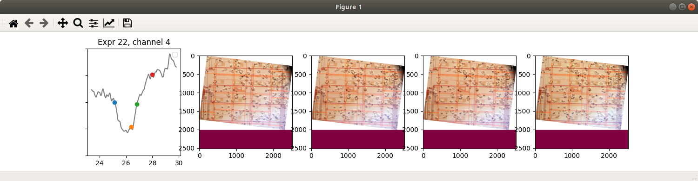
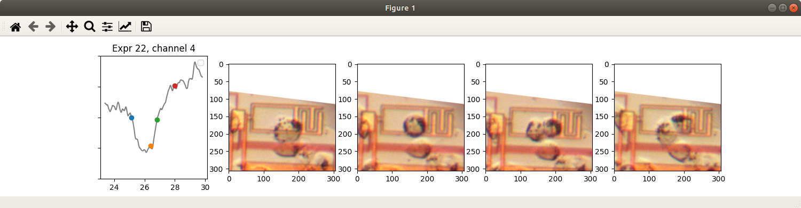
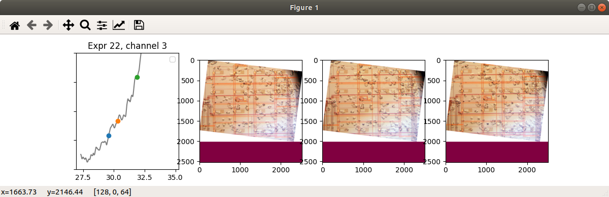
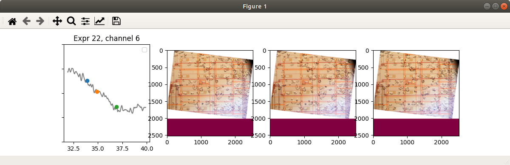

# Cell-behavior-labeling
This is a script to label cell behaviors with different phases. For the data access, please refer to [this link](https://ieee-dataport.org/open-access/measurements-cancer-cell-proliferation-using-lab-cmos-capacitance-sensor-time-lapse#files). In this script, we provide an interface to visualize the cell status with different time label. It supports the following labeling mode.

- Label from scratch
- Label with prelabel log

## Prerequiste

- The image folder path: This can be specified with ```--img-path``` in the labeling code
- The capacitance signal folder path: This can be specified with ```--cdata-dir``` in the labeling code
- Time label for each cell behavior: A csv file (default: ```slope_phase.csv```) consists at least the following attributes
  - Exp. index: The index of the experiment. Each experiment means an independent run of cell culture.
  - Channel: The channel index, or can be interpreted as the sensor index. This attribute gives a hint to labeler which sensor to look at.
  - Behavior: The name of the cell behavior. In this example, we use "Mitosis-phase1", "Mitosis-phase2", "Migrate-in", "Migrate-out", but users can extend the behavior set as their wish.
  - Occur time: A floating-point number to show the exact time for the cell behavior. This attribute will be used to identify each cell behavior along with its **exp. index** and **channel**
  - (Required if mitosis) mitosis-phase1/2/3/4: 4 different time label with the occur time of different phases. These labels should correspond to an image with the same time. For example, ```29.567``` in the channel 3 of experiment 22 matches the image ```exp22_t29-567.jpg``` in the dataset. A '-' can be used if the phase is not clear.
  - (Required if migration) migration-phase1/2/3: 3 differnt time label with the occur time. Same as mitosis-phase1/2/3/4
  
## Label from scratch

To label data from scratch, we need to create a empty label log file first. This label log file will record your label during the label process and you can reuse them next time. We provide a script to generate an empty label log.
```
python3 create_empty_log.py --log-json log_mitosis.json
python3 create_empty_log.py --log-json log_migration.json
```

After that, you should see ```log_mitosis.json``` and ```log_migration.json``` created. You can use these two log to start your labeling process.

### Mitosis labeling

We first start with mitosis labeling processing

```
python3 visualize_mitosis_3phase.py --phase-csv slope_phase.csv [--log-json log_mitosis.json]
```

The default log file path is ```log_mitosis.json``` so you don't need to explicitly specify it.

The labeling interface looks like the following. The first subplot is the time sequence of capacitance difference. Four color points on the signal (blue/orange/green/red) indicate 4 phases chronologically, and these 4 phases are shown in the other subplots.



To crop the region of interest, **click the top left corner** on one of the shown image, then **click the bottom right corner**. You should see the cropped image afterwards.



### Migration labeling

Migration labeling is same as mitosis labeling

```
python3 visualize_migratein_3phase.py --phase-csv slope_phase.csv [--log-json log_migration.json]
```



You can also label migrate-out event by specifying ```--label Migrate-out``` (Here we skip the ```--log-json``` argument```)

```
python3 visualize_migratein_3phase.py --phase-csv slope_phase.csv --label Migrate-out
```


